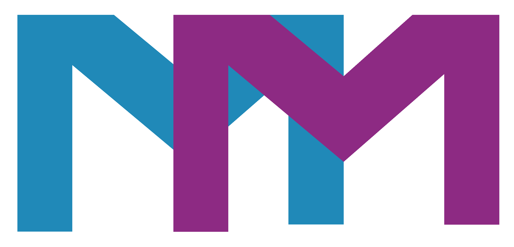

# MEDEIA-MACINA



Medeia-Macina is a text-first media manager and plugin runtime for searching, downloading, tagging, archiving, replaying, and moving media through one CLI. It is built around pipeable commands, rich result tables, and row replay so you can move from search to action without leaving the terminal.

The current UX is plugin-first. Configuration is under `.config` → Plugins (`plugin.*`).

## What Medeia-Macina Does

- Search local and remote sources through plugins.
- Browse results as tables and replay rows with `@N`.
- Chain follow-up actions with `|`.
- Add or move files into configured backends such as HydrusNetwork.
- Inspect metadata, tags, URLs, and file details from the same CLI.
- Hand media off to MPV for playback, screenshots, and related workflows.
- Load bundled plugins or drop-in plugins from external paths.

## How The App Works

The basic interaction loop is:

1. Run a command that returns a table.
2. Use `@N` to select a row.
3. Let the row replay its plugin-defined action, or pipe it into another command.
4. Use `.config` any time to inspect or update configuration.

That means rows are not just display data. A row can carry selection arguments or a full replay action. Depending on the plugin and row type, plain `@N` might open a nested table, download a file, show details, or trigger another plugin-specific workflow.

## Plugin System

Plugins are the main integration surface for the app.

- Built-in integrations such as HydrusNetwork, yt-dlp/YouTube, FTP, SCP, Soulseek, Telegram, Internet Archive, OpenLibrary, Bandcamp, and others are treated as plugins.
- Plugins can expose named instances, so one plugin can target multiple endpoints, accounts, or servers via `-instance <name>`.
- Bundled and external plugins use the same `plugins/<name>/` layout.
- External plugin search paths include the repo `plugins/` folder, the current working directory `plugins/` folder, `MM_PLUGIN_PATH`, and `MEDEIA_PLUGIN_PATH`.
- Plugin authoring still uses the current Python base class name `PluginCore.base.Provider`. That is an implementation detail rather than the preferred user-facing term.

See [plugins/README.md](plugins/README.md) for plugin packaging and discovery details.

## Configuration

Use `.config` from inside the CLI:

- `.config` opens the root configuration table.
- `@N` drills into a selected section.
- `@..` goes back.
- `.config plugins` jumps straight to the user-facing plugin section.
- Selecting a value row and running `.config <value>` updates that setting.

This keeps configuration inside the same table-and-selection model as the rest of the app.

## Installation

Requirements:

- Python 3.9 through 3.13
- Git (used to clone the repository)
- `mpv` recommended for playback workflows

The canonical installer is `scripts/bootstrap.py`. It works on Linux, macOS, and
Windows. It creates a `.venv`, installs dependencies, and exposes the `mm`
console command.

### Linux / macOS

From a git checkout:

```bash
python3 scripts/bootstrap.py
```

For an editable development install:

```bash
python3 scripts/bootstrap.py --install-editable
```

Skip optional runtime dependencies when they are already managed separately:

```bash
python3 scripts/bootstrap.py --no-mpv --no-deno --no-playwright
```

After installation, `mm` is available globally as `~/.local/bin/mm`. Make sure
`~/.local/bin` is on your `PATH` (added automatically to `~/.profile`).

### Windows

From a git checkout:

```powershell
python scripts/bootstrap.py --install-editable
```

Or use the PowerShell wrapper if preferred:

```powershell
.\scripts\bootstrap.ps1 -Editable
```

Use `-NoMpv`, `-NoDeno`, or `-NoPlaywright` to skip optional external runtimes.

### Bootstrap flags

| Flag | Description |
|------|-------------|
| `--install-editable` | Install in editable mode (`pip install -e scripts`) |
| `--skip-deps` | Skip `pip install -r scripts/requirements.txt` |
| `--no-playwright` | Skip Playwright browser install |
| `--browsers <list>` | Playwright browsers to install (default: `chromium`) |
| `--no-mpv` / `--no-deno` | Skip mpv / Deno installation |
| `-q, --quiet` | Reduce output |
| `-y, --yes` | Assume yes for confirmation prompts |
| `--uninstall` | Remove local `.venv` and user shims |

Platform-specific wrappers (`bootstrap.ps1`, `bootstrap.sh`) delegate to the
Python bootstrap and accept equivalent flags. `python scripts/bootstrap.py` is
the recommended entry point on all platforms.

## First Run

After launching `mm`, start with configuration:

```powershell
.config
.config plugins
```

If you want the full archive/tag/search workflow, HydrusNetwork is usually the first plugin to configure.

## Example Workflows

Browse plugin configuration:

```powershell
.config
.config plugins
```

Search a configured plugin instance:

```powershell
search-file -plugin ftp -instance work "invoice"
```

Replay a selected row:

```powershell
@1
```

Ingest a selected remote result into a configured backend:

```powershell
@1 | add-file -instance tutorial
```

Upload a local file through a plugin:

```powershell
add-file C:\Media\report.pdf -plugin ftp -instance archive
```

The exact meaning of `@1` depends on the current table and plugin. For example, one row may open a nested directory table while another row may download or replay a file-specific action.

## Core Concepts

- `search-file`: search a plugin, source, or configured backend and produce a table.
- `@N`: replay or select row `N` from the most recent table.
- `|`: pipe the selected result into the next command.
- `add-file`: ingest a file into a configured backend or upload through a plugin.
- `.config`: browse and edit configuration from inside the CLI.
- `.mpv`: hand media off to the integrated MPV workflow.

## Documentation

- [docs/tag_template_syntax.md](docs/tag_template_syntax.md)
- [plugins/README.md](plugins/README.md)
- [docs/plugin_guide.md](docs/plugin_guide.md)
- [docs/plugin_authoring.md](docs/plugin_authoring.md)
- [docs/ftp_plugin_tutorial.md](docs/ftp_plugin_tutorial.md)
- [docs/scp_plugin_tutorial.md](docs/scp_plugin_tutorial.md)
- [docs/BOOTSTRAP_TROUBLESHOOTING.md](docs/BOOTSTRAP_TROUBLESHOOTING.md)

## Current Direction

Medeia-Macina is moving toward one canonical plugin model:

- user-facing integrations are described as plugins
- plugin rows carry their own replay actions when needed
- nested tables use the same `@N` and `@..` interaction model across config and plugin workflows
- Hydrus-backed archiving, metadata, and playback flows are treated as part of the same CLI pipeline rather than separate apps


# Medeia-Macina
# Medeia-Macina
